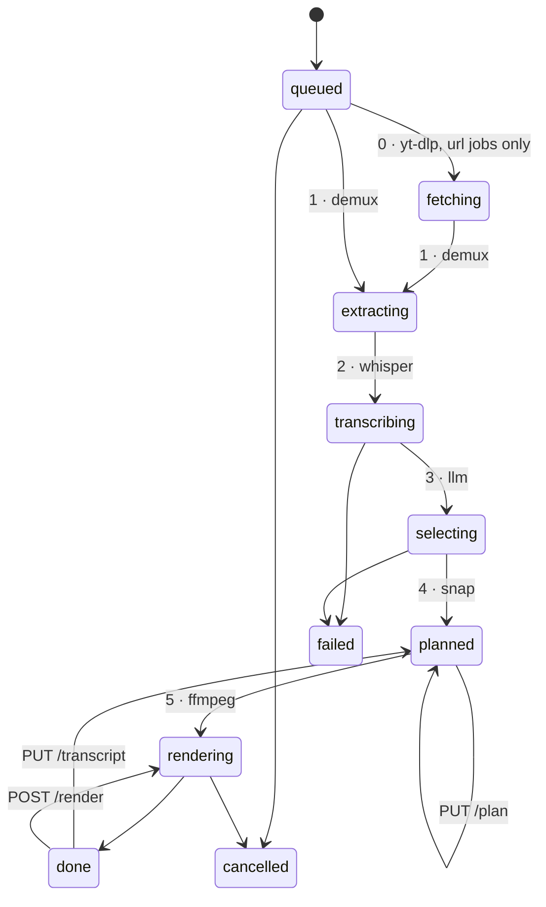
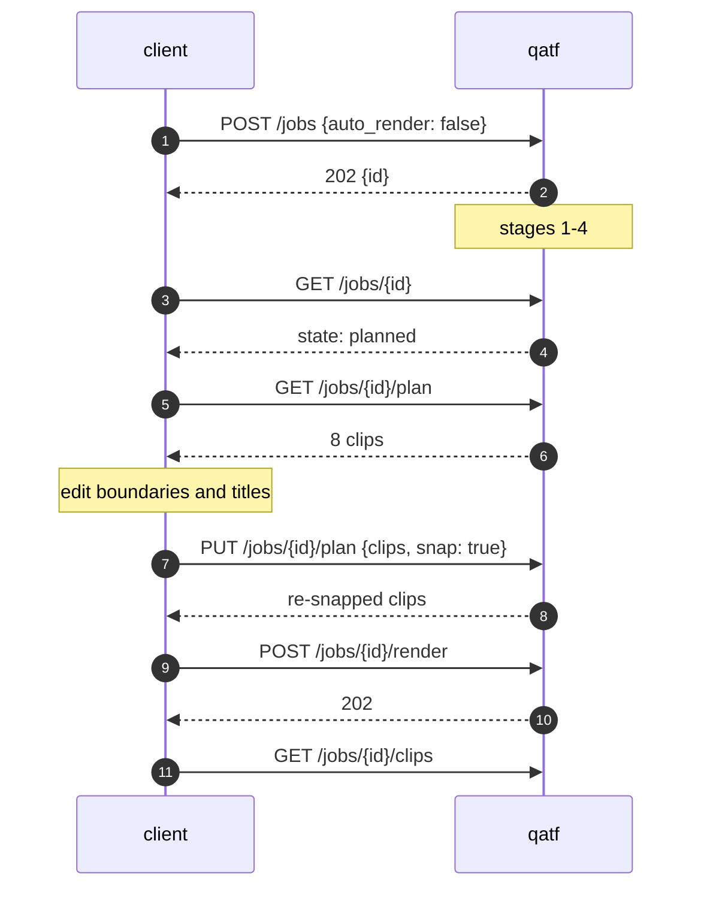

# HTTP API

```bash
cd qatf-backend
uvicorn qatf.api:app --reload      # or: qatf-serve, or: python -m qatf.api
```

| Surface | Path |
| --- | --- |
| Swagger UI | `http://localhost:8000/docs` |
| ReDoc | `http://localhost:8000/redoc` |
| Schema | `http://localhost:8000/openapi.json` |

`/docs` is the live contract and carries the same warnings as this page. This
file exists for reading offline and for the parts a schema cannot express.

The pipeline takes minutes, so **nothing is synchronous**. Every start returns
`202` and a job id; the client polls `GET /jobs/{id}`.

---

## Endpoints

| Method | Path | `operationId` | |
| --- | --- | --- | --- |
| `GET` | `/healthz` | `health` | readiness, provider roster, transcription device |
| `POST` | `/jobs` | `createJob` | start from a server-side path |
| `POST` | `/jobs/upload` | `createJobFromUpload` | start from a multipart upload |
| `POST` | `/jobs/url` | `createJobFromUrl` | start from a YouTube URL. `403` off the allowlist |
| `GET` | `/jobs` | `listJobs` | list, optional `?state=` |
| `GET` | `/jobs/{id}` | `getJob` | **poll this** |
| `DELETE` | `/jobs/{id}` | `deleteJob` | refuses while running |
| `POST` | `/jobs/{id}/cancel` | `cancelJob` | cooperative |
| `GET` | `/jobs/{id}/transcript` | `getTranscript` | words, as they will be captioned |
| `PUT` | `/jobs/{id}/transcript` | `correctTranscript` | fix misheard words |
| `GET` | `/jobs/{id}/plan` | `getPlan` | |
| `PUT` | `/jobs/{id}/plan` | `replacePlan` | the hand-edit round trip |
| `POST` | `/jobs/{id}/render` | `renderPlan` | replaces previous outputs |
| `GET` | `/jobs/{id}/clips` | `listClips` | |
| `GET` | `/jobs/{id}/clips/{name}` | `downloadClip` | |

Operation ids are hand-named so a generated client gets `client.createJob(...)`
rather than `client.create_from_path_jobs_post(...)`. The smoke suite asserts
they stay that way.

---

## Job lifecycle



`fetching` occurs only on a job started from `POST /jobs/url`. It is its own
state rather than part of `extracting` because it is the one stage whose duration
depends on somebody else's network — a job sitting still deserves to say whether
it is waiting on YouTube or on ffmpeg.

`queued`, `fetching`, `extracting`, `transcribing`, `selecting` and `rendering`
are the **running** states. A job in one of them cannot be deleted, re-planned or
re-rendered — cancel it first.

Set `auto_render: false` to stop at `planned`.

---

## Start a job

```bash
curl -X POST localhost:8000/jobs \
  -H 'content-type: application/json' \
  -d '{
        "path": "talks/keynote.mov",
        "clips": 8,
        "min_len": 28,
        "max_len": 52,
        "language": "ar",
        "denoise": true,
        "font": "Traditional Arabic",
        "auto_render": false
      }'
```

```json
{ "id": "a1b2c3d4e5f6", "state": "queued", "message": "waiting for a worker", ... }
```

`path` resolves under `QATF_MEDIA_ROOT`. That is a **security boundary**: without
it a body naming `../../etc/passwd` would have the server transcribe any file the
process can read. Absolute paths are allowed but must still land inside the root;
anything escaping is `403`.

### From an upload

`options` is a JSON **string** form field, because a multipart body cannot carry
a nested JSON object.

```bash
curl -X POST localhost:8000/jobs/upload \
  -F 'file=@keynote.mov' \
  -F 'options={"clips": 8, "language": "ar", "denoise": true, "max_len": 52}'
```

Streamed to disk in 1 MB chunks and checked against `QATF_MAX_UPLOAD_MB` as it
arrives, so an oversized upload is refused mid-stream rather than after the whole
file has landed. A failed upload takes its job record with it.

---

## Poll

```bash
curl -s localhost:8000/jobs/a1b2c3d4e5f6 | jq '{state, message, device, word_count}'
```

```json
{
  "state": "rendering",
  "message": "[5/5] rendered 3/8: 03-php-lsh-ayshh.mp4",
  "device": "cuda",
  "word_count": 2841
}
```

**Poll `GET /jobs/{id}`, not `GET /jobs`.** The single-job endpoint is flat cost;
the list endpoint is linear in the number of jobs and dominated by a `stat()` per
rendered clip, so polling it turns into thousands of syscalls a second once a
server has accumulated jobs. Numbers in
[quality.md](quality.md#the-api-layer).

Three fields are worth reading on the way past:

- **`device`** — what stage 2 *actually* used. Under `device: auto` this can be
  `cpu` on a GPU host, and a `large-v3` CPU run takes a very long time.
- **`transcript_cached`** — whether stage 2 ran at all.
- **`outputs`** — grows during `rendering` rather than appearing all at once, so
  progress is visible clip by clip.

### Stage 0 progress on a URL job

`fetch_progress` reports how far the download has got, updated about once a
second while `state=fetching`. It is **null on a job that never fetched**, which
is not the same as a job sitting at zero bytes — only a `source=youtube` job can
ever be in the second, so do not render a bar for the first.

```json
{
  "state": "fetching",
  "message": "[0/5] fetching the video and its captions",
  "fetch_progress": { "downloaded_bytes": 431820800, "total_bytes": 1181116006, "file_index": 1 }
}
```

Two things about these numbers, both of which will otherwise read as bugs:

- **`total_bytes` may be an estimate, and it can be null.** yt-dlp frequently
  reports only `total_bytes_estimate`, which an actual download can overshoot.
  Clamp a progress bar at 100% and leave the byte counts alone — the bytes are
  measured, the total may not be. When nothing knows the size the field is null,
  and the honest rendering is a byte count with no percentage at all rather than
  a bar against an invented denominator.
- **`downloaded_bytes` restarts at zero when `file_index` increments.** A merged
  DASH fetch downloads the video stream and the audio stream as *separate*
  files, so one download the user sees is two the server performs. Report the
  part — the web UI shows `part 2 · …` — rather than smoothing the reset into a
  fake monotonic percentage that hides it.

The reading is coalesced to roughly one write per second, because yt-dlp reports
per chunk and every write is a transaction. The **closing** reading for each file
bypasses that throttle, so a finished download is never left recorded as partway
through.

---

## Correcting misheard words

`GET /jobs/{id}/transcript` returns the transcript **as it will be captioned** —
fixups, loop repair and any existing corrections already applied. What you read
is what gets burned in.

```bash
curl -s localhost:8000/jobs/$ID/transcript > t.json
```

```json
{ "text": "هو",  "start": 204.11, "end": 204.29 },
{ "text": "من",  "start": 204.29, "end": 204.58 },   ← should be مين
{ "text": "قال", "start": 204.58, "end": 204.91 }
```

The `start` is how you find it: 204.29 s is 3:24, so scrub there, hear what was
actually said, then fix the text and send the whole list back.

> **Some words come back with an empty `text`, and you must send them back.**
> When the decoder loops — four or more identical tokens in a row, which happens
> on noisy audio — `health.repair` blanks the duplicates rather than deleting
> them, so the word count and every `start`/`end` stay exactly as Whisper
> measured them. A blank renders as nothing, but it is still a real element of
> `words`. Drop them before your `PUT` and you have changed the word count,
> which is a `422` for the same reason a deletion is.
>
> `jq '{words: .words}'` above does the right thing already; a hand-written
> filter that strips empty strings does not.

```bash
jq '{words: .words}' t.json | \
  curl -X PUT localhost:8000/jobs/$ID/transcript \
       -H 'content-type: application/json' -d @-

curl -X POST localhost:8000/jobs/$ID/render
```

> **Only `text` may differ.** The word count and every `start`/`end` must match
> exactly; anything else is a `422`. That refusal is the core invariant enforced
> at the boundary — a correction can change what a caption reads and can never
> move a cut.
>
> It is also what makes this cheap: the cut points are *provably* identical, so
> only stage 5 runs again. No model call, no re-transcription.

To split one word into two, put both in that word's `text`. There is no honest
timing to give a word Whisper never heard.

### Why not just use `fixups`?

`fixups` is a global find-and-replace, keyed by **value**. It fixes the
systematic errors — a term the decoder always mishears the same way — and it is
the right tool for those, because it generalises across the whole file and across
future videos.

It cannot fix a word that is wrong *here* and correct everywhere else. A rule
`من = مين` would rewrite every `من` in the file, and `من` is one of the most
common words in Arabic. Corrections are keyed by **position**, so they touch that
one word.

Use both. Fixups run first, so a correction wins on the word it names.

### Corrections are an overlay

Stored in the `word_edits` table, in the same `<work>/qatf.db` as the transcript
cache but never inside the cached row itself, for two reasons:

- re-transcribing must not silently discard them
- the cache has to keep saying what Whisper *actually* produced, or the
  measurements in [quality.md](quality.md) stop meaning anything

Each correction records the text it replaced. If the transcript later moves
underneath it — a re-transcribe at a different `whisper` size, `denoise` toggled
— the correction goes **stale**: skipped, not applied, and counted in
`edits_stale`. An index alone would have landed silently on an unrelated word.

`PUT` is a wholesale replace, so re-submitting the untouched transcript clears
every correction.

A job in `done` drops back to `planned` when you correct it, because its rendered
clips now caption text nobody will see again.

### What it does not fix

Correcting text does not move a caption in time, and does not change which
passages the model picked — selection already ran. If a misheard word made the
model skip a good moment, fix the word and edit the plan directly.

---

## Server settings

Three endpoints change what stage 3 uses, without editing `.env` or rebuilding.

| Method | Path | |
| --- | --- | --- |
| `GET` | `/settings` | every editable key, its value and its **source** |
| `PUT` | `/settings` | partial update — send only what changed |
| `DELETE` | `/settings/{key}` | drop the override, fall back to the environment |

```json
{ "items": [
  { "key": "llm_model", "value": "anthropic/claude-opus-5",
    "source": "saved", "restart_required": false },
  { "key": "workers", "value": 1, "source": "env", "restart_required": true }
]}
```

**Editable:** `llm_provider`, `llm_model`, `llm_base_url`, `llm_effort`,
`llm_max_tokens`, `llm_timeout`, `workers`. Anything else is a `422` naming the
allowed set.

**`source` is why "reset to environment" can exist.** Without it a caller cannot
tell a value they chose from one the container handed them. `saved` overrides
the matching `QATF_*` variable; `DELETE` removes the override and the variable
takes over again.

**A saved value beats the environment.** That is the opposite of `.env` parsing
and it is deliberate — compose always sets `QATF_LLM_*`, so an
environment-wins rule would make these endpoints inert under Docker.

**Changes apply to the next job.** A job already running keeps the settings it
started with; its record reports the provider and model it actually used.
`workers` is stored but carries `restart_required` — the worker pool is not
resized with jobs in flight.

**Two refusals worth expecting.** `422` for a key outside the allowlist, and
`403` for a `base_url` that is neither a known provider host nor a private
address. Neither echoes your input back.

**API keys are not here.** Presets name a credential and read it from the
environment; nothing stores or returns one. Check `/healthz` `llm_ready` for
whether the configured provider has a usable key.

---

## Clips outside the length you asked for

`clips` is what the model was asked for; `min_len`/`max_len` is the length it
was asked for. It misses sometimes, and when it does **the clip is kept, not
discarded** — every clip in the plan gets rendered.

Each one carries `out_of_range`: `"short"`, `"long"`, or `null`.

```json
{
  "clips": [
    { "start": 145.3, "end": 195.9, "title": "...", "out_of_range": null },
    { "start": 402.1, "end": 426.3, "title": "...", "out_of_range": "short" }
  ],
  "message": "done. 8 clips — 6 of 8 outside 30-52s, kept and flagged"
}
```

**Read it before publishing.** `len(clips)` no longer tells you they are all
usable — a plan of 8 can be 6 clips that missed the range. What the two labels
mean in practice:

- **`short`** — under `min_len`. Usually still publishable; a 24s clip is a
  perfectly good Short. If most of a plan is short and the durations cluster,
  the model is likely sizing clips by transcript-line count rather than by
  seconds — see `docs/quality.md`.
- **`long`** — over `max_len`. Worth checking before upload: YouTube Shorts
  rejects anything past 60s, so a `long` clip may be unpostable there even
  though it rendered fine.

The label allows `DURATION_SLACK` (2s) either side, so it means *the model*
missed the range — not that snapping nudged a boundary onto a word end. A 53s
clip against `--max-len 52` is not flagged.

`out_of_range` is **server-computed and read-only**. It is derived on every read
from the clip and the job's options, never stored, so a plan edit cannot leave a
stale label behind. A value sent to `PUT /jobs/{id}/plan` is discarded and
recalculated — edit a clip to 20s and it comes back marked `short`.

---

## Caption style: `youtube` pill or `pop`

`caption_style` (`JobOptions`, default `"youtube"`) picks between two burned-in
styles. `youtube` puts every word in its own filled capsule when it is being
spoken, dims the rest of the line, and works on Arabic as well as Latin. `pop`
is the original style: one caption line at a time, with per-word colour
highlighting on Latin only.

`youtube` needs shaped word measurement **on the rendering host** — under the
API that is the server, not the caller. Where it is unavailable (the
`captions` extra not installed, or the requested font unresolvable by
fontconfig) the job logs why, renders `pop` instead, and never fails for it.
The style actually used is on the job record:

```json
{ "options": { "caption_style": "youtube" }, "caption_style_used": "pop" }
```

`caption_style_used` differs from `options.caption_style` exactly when that
fallback fired. It is empty on a record written before this field existed, and
on any job with `captions: false` — nothing was burned in to have a style.

**Check readiness before submitting, not after rendering.** `GET /healthz`
reports `caption_pill_ready`: `false` means every job that asks for `youtube`
on this host will silently fall back, the same way `cuda_devices` and
`transcribe_device` let you tell before an hour of audio whether stage 2 will
run on a GPU.

---

## The hand-edit round trip

This is the part worth understanding, because it is what makes iteration cheap:
everything from `planned` onward costs **no model call and no re-transcription**.



```bash
curl -s localhost:8000/jobs/$ID/plan > plan.json
$EDITOR plan.json

curl -X PUT localhost:8000/jobs/$ID/plan \
  -H 'content-type: application/json' \
  -d "$(jq '{clips: ., snap: true}' plan.json)"

curl -X POST localhost:8000/jobs/$ID/render
```

> **Leave `snap` on.** Your edited boundaries get moved back onto real Whisper
> word times. A hand-typed `"start": 20.0` is a semantic guess exactly like the
> model's, and skipping the snap is how clips end up opening mid-syllable. The
> boundaries you get back will differ slightly from the ones you sent — that is
> the feature working.

`PUT /plan` replaces the plan wholesale. There is no partial update: send the
clips you want, in the order you want them numbered.

`POST /render` **deletes the previous clips first.** Download anything you want
to keep before re-rendering. Passing an `options` body replaces the job's whole
options object — send the full set, not a patch — and only the stage-5 fields
take effect, since the transcript and plan already exist.

---

## `JobOptions`

Every field has a working default, so `{"path": "talk.mov"}` is a complete
request. Same names and defaults as the CLI flags.

| Field | Default | Range / values |
| --- | --- | --- |
| `clips` | `5` | 1–50 |
| `min_len` | `30` | 1–600 s |
| `max_len` | `75` | 1–600 s · **use 52 for Shorts** |
| `reframe` | `crop` | `crop` · `blur` · `track` — `track` needs OpenCV **on the server** |
| `track_tier` | `balanced` | `fast` · `balanced` · `best`; face detection at 1 · 3 · 8 fps. `track` only |
| `codec` | `h265` | `h264` · `h265` — h265 is ~3x slower to encode |
| `preset` | `medium` | `veryslow` … `ultrafast`; the render-time lever |
| `resolution` | `1080p` | `source` · `1080p` · `1440p` · `4k` · `WxH` |
| `ten_bit` | `false` | needs a 10-bit source |
| `crf` | `20` | 0–51, lower is better |
| `whisper` | `large-v3` | any faster-whisper size |
| `device` | `auto` | `auto` · `cuda` · `cpu` |
| `language` | `null` | e.g. `ar`; omit to autodetect |
| `denoise` | `false` | |
| `fixups` | `null` | `{"بايسون": "بايثون"}` — text only, never timestamps |
| `hotwords` | `null` | ≤4000 chars; whole-file bias |
| `initial_prompt` | `null` | ≤4000 chars; **first ~30 s only** |
| `font` | `Arial` | must be installed **on the server** |
| `captions` | `true` | |
| `per_line` | `4` | 1–8 words |
| `caption_style` | `youtube` | `youtube` · `pop` — see [below](#caption-style-youtube-pill-or-pop) |
| `auto_render` | `true` | `false` stops at `planned` |

`min_len > max_len` is rejected at the boundary, as is an unparseable
`resolution` — better than failing three minutes into a job when the worker
finally reaches stage 5.

Two fields behave differently from what their names suggest:

- **`hotwords` applies to the whole file; `initial_prompt` seeds only the first
  ~30 seconds** and then decays. Prefer `hotwords`. Both are part of the
  transcript cache key.
- **`font` is resolved on the rendering host**, which under the API is the
  server, not the caller's machine. libass falls back silently, so a missing
  Arabic face ships as tofu rather than an error.

`reframe: track` is the third: it runs a **face detector on the server**, so the
server needs OpenCV (`pip install -e ".[track]"`; the weights are vendored). If
it cannot, the job fails with `DetectorNotAvailable` rather than quietly
rendering a static crop — same contract as `device: cuda`. Note also that
tracking frames the largest face, not the speaker: the active-speaker model is
not built, so `track_tier` buys sample rate and nothing else. Detections are
cached per video under the job's work directory, so re-rendering an edited plan
does not re-run the detector.

---

## Errors

Domain failures carry their own status code and always come back as
`{"detail": "..."}`. One exception handler maps the whole `QatfError` hierarchy —
routers never hand-map a domain failure, which is how HTTP concerns stay out of
the pipeline.

| Status | Means |
| --- | --- |
| `403` | the path escaped `QATF_MEDIA_ROOT` — a security refusal, not a typo check |
| `404` | no such job, no plan yet, no such clip |
| `409` | the job is running, or you asked for something that needs a transcript first |
| `413` | upload over `QATF_MAX_UPLOAD_MB`, or the transcript exceeds the model's context |
| `415` | unsupported video extension |
| `422` | validation failed, no speech was found, or the vocabulary seed is too long |
| `502` | stage 3 returned something that was not the requested JSON, or refused |
| `503` | a dependency the server needs is absent: ffmpeg, the stage-3 credential, faster-whisper (`TranscriberNotAvailable`), or OpenCV for `reframe: track` (`DetectorNotAvailable`) |

A `500` means a bug: every deliberate failure is a `QatfError` subclass, so
anything else escaping the pipeline was not thought through.

Each status is declared per-route in the OpenAPI schema and typed as
`ErrorResponse`, so generated clients get a real error type rather than an
untyped body. Where several distinct failures share a code — `PUT /plan` 409s for
both "job is running" and "no transcript yet" — the descriptions are joined
rather than one silently winning.

---

## `/healthz`

**Call this before submitting an hour of audio.** It never 503s; read `status`
and the individual flags.

```json
{
  "status": "degraded",
  "version": "0.4.0",
  "model": "anthropic/claude-opus-5",
  "ffmpeg": true,
  "media_root": "/srv/media",
  "max_workers": 1,
  "llm_provider": "openrouter",
  "llm_ready": false,
  "llm_error": "provider 'openrouter' needs an API key — set OPENROUTER_API_KEY",
  "cuda_devices": 1,
  "transcribe_device": "cuda",
  "caption_pill_ready": true,
  "providers": [ ... ]
}
```

`degraded` is not fatal — the server still accepts jobs — but a job that reaches
stage 3 without a credential fails *after* transcription has already run, which
is minutes wasted.

Cheap to poll: the ffmpeg probe is primed at startup and served from cache, so the
handler costs ~1 ms. It used to spawn a process per request and measured p99 over
a second under load — see
[quality.md](quality.md#healthz-forked-a-process-per-request).

- **`cuda_devices`** is what **CTranslate2** can actually target, not what
  `nvidia-smi` reports. A card the installed CTranslate2 cannot use (compute
  capability, driver mismatch) is not a usable device, and only the engine knows.
- **`transcribe_device`** is what stage 2 will pick under `device: auto`.
- **`caption_pill_ready`** — whether the `youtube` pill caption style can
  actually render on this host. `false` means `uharfbuzz` is not installed or
  fontconfig cannot resolve the default font, and every job that asks for it
  will silently fall back to `pop` — see
  [Caption style](#caption-style-youtube-pill-or-pop).
- **`providers`** carries the whole stage-3 roster with each entry's
  structured-output tier, so a client can offer a provider picker without
  hardcoding one.

---

## Configuration

| Variable | Default | |
| --- | --- | --- |
| `QATF_DATA_DIR` | `qatf-data` | job directories |
| `QATF_MEDIA_ROOT` | `.` | the `POST /jobs` sandbox |
| `QATF_WORKERS` | `1` | concurrent jobs |
| `QATF_MAX_UPLOAD_MB` | `2048` | |
| `QATF_HOST` / `QATF_PORT` | `127.0.0.1` / `8000` | |
| `QATF_LLM_PROVIDER` | `anthropic` | see [providers.md](providers.md) |
| `QATF_LLM_MODEL` | preset default | `QATF_MODEL` is the pre-0.5 name, still honoured |
| `QATF_LLM_BASE_URL` | preset default | |

`Settings` is a plain frozen dataclass, not pydantic-settings — pydantic is an
API-only dependency and the CLI must not need it.

`create_app(settings=...)` takes an explicit object, which is how the tests point
at a scratch directory without touching `os.environ`. `JobStore` carries that
same object so workers read the settings the app was built with; reaching for the
process-wide `get_settings()` inside a worker would make `create_app(settings=…)`
a half-truth.

---

## On-disk layout

```text
$QATF_DATA_DIR/
  qatf.db                        job records (`jobs`) and cancel flags (`cancels`)
  <job-id>/
    source/                        uploads only
    .work/
      audio.wav                    or audio-denoised.wav
      qatf.db                      this job's own database — transcripts,
                                    word_edits, detections
      *.ass                        generated subtitles
    clips/
      01-slug.mp4
```

Job records and cancel flags are rows in the root `qatf.db`, not a JSON file per
job. `GET /jobs` and `GET /jobs/{id}` query it on every call — there is no
in-memory job dict — which is what keeps them correct with more than one writer.
The transcript cache, the per-word correction overlay and the face-detection
cache are rows in a *separate* `qatf.db` inside each job's own `.work/`
directory, so a job stays self-contained and deleting it does not touch any
other job's data. See
[quality.md](quality.md#the-sqlite-move-read-cost-roughly-doubled-and-stayed-inside-budget)
for what the move cost and [`core/db.py`](../qatf-backend/qatf/core/db.py) for the schema.

Rendered MP4s stay on the filesystem under `clips/` — SQLite is for records, not
video. A pre-SQLite `job.json`, `words-<model>-<lang>.json`, `word-edits.json` or
`faces-*.json` is imported into the relevant database the first time it is read
and then **left on disk, never deleted** — an upgrade stays reversible by
checking out the previous commit.

`plan.json` stays a real file, but only on the CLI side (`--plan out/plan.json`,
`--plan-only`): the API never writes one, because a job's plan is just the
`clips` field on its own record. `--plan` is the documented hand-edit round trip
for a human editing a file in `$EDITOR`, which is exactly the case a database row
does not help — see [the hand-edit round trip](#the-hand-edit-round-trip) above
for the same round trip over HTTP.

Deleting a job removes the whole directory — including its `.work/qatf.db` and
everything cached in it — plus the job's row and cancel flag from the root
`qatf.db`.

---

## Limits to know before deploying

1. **Jobs do not survive a restart.** The record is a row in `qatf.db`, but the
   worker is an in-process thread pool. On startup anything left running is
   marked `failed: interrupted by a server restart` — the row survives, nothing
   is left holding it.
2. **Cancellation is cooperative.** The flag is checked between stages and
   between clips. A cancel during stage 2 on a long file lands whenever
   transcription finishes — not straight away. Poll for `state: cancelled` to
   know it actually stopped.
3. **`QATF_WORKERS` defaults to 1.** Two concurrent `large-v3` loads fight over
   the same GPU. Raise it only for render-only work.
4. **WAL makes concurrent writes safe. It does not make `QATF_WORKERS` safe
   across processes.** Two server processes pointed at the same
   `QATF_DATA_DIR` would each pull queued jobs onto their own pool and run the
   same job twice — SQLite stops a write from tearing, it does not stop two
   workers from claiming the same row. Job claiming — an atomic
   `UPDATE ... WHERE state='queued'` that hands exactly one worker the job — is
   **not implemented**. Run one server process per `QATF_DATA_DIR` until it is;
   scaling beyond one process needs that first.

**The API has never run against a real video, a real GPU or a real API key.**
Every stage boundary is exercised by `tests/smoke_api.py` (154 checks), which
fakes `pipeline.audio.run`, `pipeline.encode.run`, `pipeline.asr.transcribe` and
`pipeline.select.pick_clips` — so it proves nothing about those four. The CLI has
run the whole thing end to end; the server has not.
